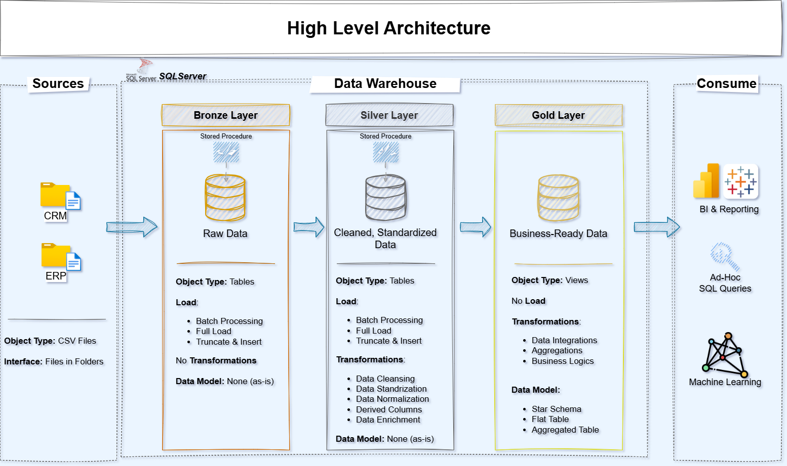

# 🛒 Sales Data Warehouse & Analytics Project

Hello! Welcome to my project.

This repository shows how I built a **Data Warehouse** from scratch using SQL Server. The goal of this project was to take messy, raw sales data and turn it into clear, reliable insights that a business can actually use.

I acted as both a **Data Engineer** (building the system) and a **Data Analyst** (finding the answers).

---

## 🏗️ How I Built It (The Architecture)

I used a method called the **Medallion Architecture**. Think of it like a water filtration system, where the data gets cleaner as it moves through the layers:



### 1. 🥉 Bronze Layer (Raw Data)
* **What it is:** This is where the data lands first.
* **What I did:** I took data from CSV files (Source Systems) and loaded it into the database exactly as it was. Even if it had errors, I kept it here so I have a record of the original state.

### 2. 🥈 Silver Layer (Clean Data)
* **What it is:** This is the "Transformation" step.
* **What I did:** I cleaned the data here. This involves fixing date formats, removing duplicates, and making sure the naming is consistent. This data is much easier to read.

### 3. 🥇 Gold Layer (Business Data)
* **What it is:** The final step, ready for reporting.
* **What I did:** I organized the data into a **Star Schema** (Fact and Dimension tables). This makes it very fast to run reports and analyze sales numbers.

---

## 🎯 Project Goals

I didn't just write code; I wanted to solve business problems. This project answers three main questions:
* **Who are the customers?** (Understanding behavior)
* **What are we selling?** (Product performance)
* **How is the business growing?** (Sales trends over time)

---

## 🛠️ Tools I Used

I used industry-standard tools to build this free of cost:
* **SQL Server Express:** To store the database.
* **SSMS (SQL Server Management Studio):** To write the queries and manage the data.
* **Draw.io:** To draw the diagrams and plan the architecture before coding.
* **Git & GitHub:** To save my work and manage versions.

---

## 📂 How the Files are Organized

Here is a simple map of this repository so you can find what you need:

```text
data-warehouse-project/
│
├── datasets/                 # The raw CSV files (ERP and CRM data) go here.
│
├── docs/                     # Documentation.
│   ├── data_architecture.png # A picture of how the system works.
│   ├── data_models.png       # A picture of the database tables (Star Schema).
│   └── data_catalog.md       # A list explaining what each dataset contains.
│
├── scripts/                  # The actual SQL code is here.
│   ├── bronze/               # Code to load raw data.
│   ├── silver/               # Code to clean the data.
│   └── gold/                 # Code to build the final reports.
│
├── tests/                    # Scripts to check if the data quality is good.
│
└── README.md                 # The file you are reading right now.
'''
---
## 📝 License
This project is open-source under the MIT License. You are free to look at the code, learn from it, or use it for your own portfolio.
